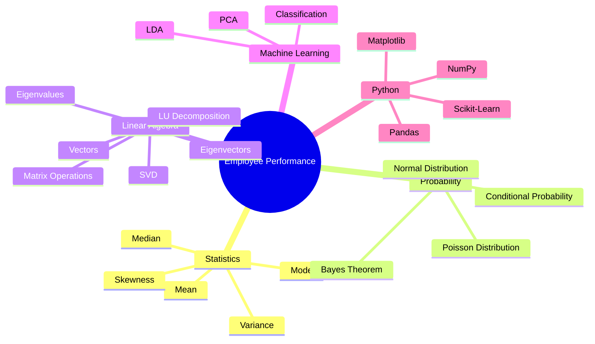
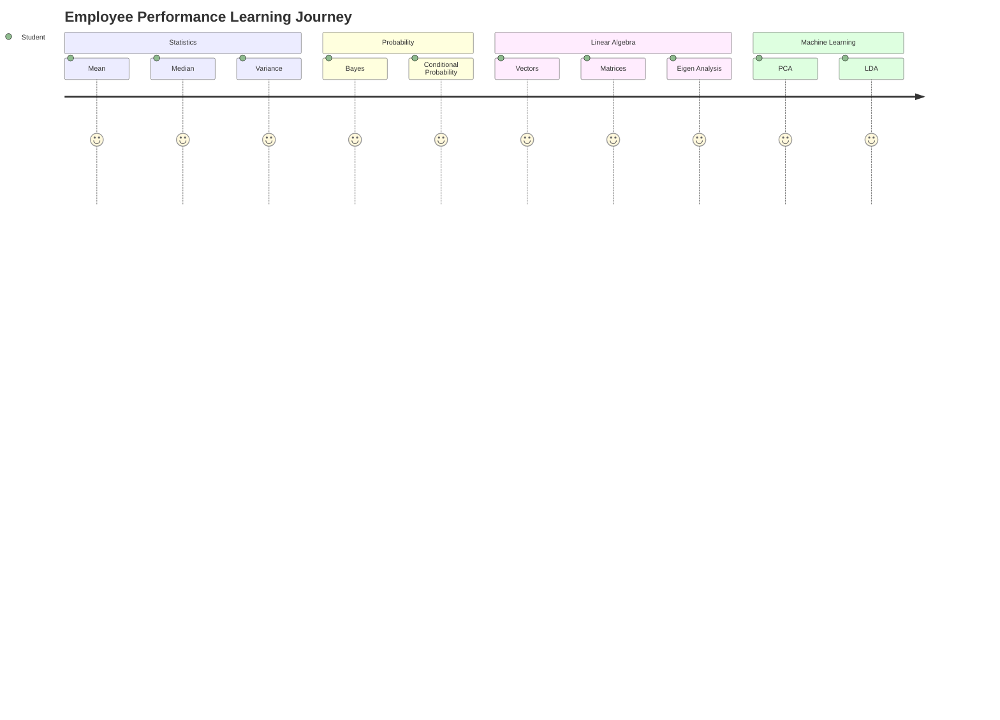

<div align="center">

# 📊 Employee Performance Analysis

### *A Complete Data Analytics Project using Statistics, Probability, Linear Algebra, and Machine Learning*


<br>


<br><br>

> **An end-to-end educational project that combines mathematical concepts with real-world employee performance analysis using Python.**

> Learn how **Statistics**, **Probability**, **Linear Algebra**, and **Machine Learning** work together to analyze employee data, generate insights, and build predictive models.

---

## 🚀 Quick Access

<a href="https://drive.google.com/file/d/1aUNxtwNbuowGyK3qPqSAJ0hdRK6ogFX-/view?usp=sharing">

</a>

<a href="https://github.com/jeelprajapati0606/Employee_Performance-/blob/main/Employee_performance/Employee_performance-checkpoint.ipynb">

</a>

<a href="https://github.com/jeelprajapati0606/Employee_Performance-/blob/main/Employee_performance/Employee%20Performance.pdf">

</a>

<a href="https://github.com/jeelprajapati0606/Employee_Performance-/blob/main/Employee_performance/employee_performance.csv">

</a>

<a href="https://github.com/jeelprajapati0606/Employee_Performance-/tree/main/Employee_performance/Output%20Images">

</a>

</div>

---

# 🌟 Project Overview

Employee Performance Analysis is a comprehensive Data Analytics project that demonstrates how mathematical concepts can be applied to solve real-world HR problems.

Instead of focusing only on theory, this project combines **Theory + Python Implementation + Visualization + Machine Learning** to create a complete learning experience.

Using an employee performance dataset, the project performs statistical analysis, probability calculations, vector and matrix operations, dimensionality reduction, and classification to understand employee productivity and performance patterns.

---

# 🎯 Objectives

- 📊 Analyze employee performance using real-world data
- 📚 Understand mathematical concepts through practical implementation
- 🧮 Apply Statistics and Probability in HR Analytics
- 📐 Perform Linear Algebra operations using employee data
- 🤖 Implement Machine Learning techniques such as PCA and LDA
- 📈 Visualize insights using charts and graphs
- 💡 Build a beginner-friendly, portfolio-ready project

---

# ✨ Project Highlights

<table>

<tr>

<td align="center" width="33%">

## 📖 Theory

Simple explanations with

✔ Definitions

✔ Formulas

✔ Real-world Examples

✔ Workplace Scenarios

✔ Python Code

</td>

<td align="center" width="33%">

## 💻 Practical

Hands-on implementation using

🐍 Python

📊 Pandas

🧮 NumPy

📈 Matplotlib

🤖 Scikit-Learn

</td>

<td align="center" width="33%">

## 📊 Visualization

Understand concepts visually through

📈 Charts

📉 Distribution Plots

📊 Heatmaps

📐 Matrix Operations

📷 Graphical Analysis

</td>

</tr>

</table>

---

# 🚀 Key Features

| Feature | Status |
|----------|:------:|
| 📖 Complete Theory Notes | ✅ |
| 📊 Statistical Analysis | ✅ |
| 🎲 Probability Concepts | ✅ |
| 📐 Linear Algebra Operations | ✅ |
| 🤖 Machine Learning Models | ✅ |
| 📈 Data Visualization | ✅ |
| 📊 Employee Dataset | ✅ |
| 📓 Jupyter Notebook | ✅ |
| 💼 Portfolio Ready | ✅ |


---

# 📊 Project Statistics

| Category | Details |
|:----------|:--------|
| 📚 Theory Questions | 8 |
| 📊 Statistics Concepts | 10+ |
| 🎲 Probability Concepts | 6 |
| 📐 Linear Algebra Topics | 15+ |
| 🤖 Machine Learning Techniques | 2 |
| 📓 Jupyter Notebook | Included |
| 📄 Theory PDF | Included |
| 📊 Dataset | Employee Performance |
| 📸 Visualizations | 20+ |
| 💻 Python Implementations | 25+ |

---

# 🧠 Learning Roadmap



---

# 📂 Dataset

This project uses an **Employee Performance Dataset** to demonstrate how mathematical concepts can be applied to solve real-world HR Analytics problems.

Instead of working with random numbers, all statistical calculations, probability analysis, matrix operations, and machine learning techniques are performed using employee data.

The dataset enables practical implementation of concepts while helping understand how organizations evaluate employee performance and productivity.

---

## 📊 Dataset Overview

| Property | Details |
|:---------|:--------|
| 📄 Dataset Name | `employee_performance.csv` |
| 📂 File Format | CSV |
| 📊 Dataset Type | Structured HR Dataset |
| 🎯 Domain | Employee Performance Analysis |
| 💻 Programming Language | Python |
| 📚 Libraries Used | Pandas, NumPy, Matplotlib, SciPy, Scikit-Learn |

---

## 📋 Dataset Features

| Column | Description |
|---------|-------------|
| 👤 Employee ID | Unique identifier for each employee |
| 🎂 Age | Employee age |
| 👨 Gender | Male / Female |
| 💼 Department | Employee department |
| 🏢 Job Role | Employee designation |
| 📅 Experience | Years of experience |
| ⏰ Working Hours | Daily working hours |
| 📁 Projects Completed | Total completed projects |
| 📊 Performance Score | Employee performance rating |
| 📈 Overall Score | Final evaluation score |
| 🎯 Category | Above Average / Below Average |

---

<div align="center">

## 📥 Download Dataset

<a href="https://github.com/jeelprajapati0606/Employee_Performance-/blob/main/Employee_performance/employee_performance.csv">


</a>

</div>

---

# 📖 Theory Concepts

Understanding mathematical concepts is essential before implementing Machine Learning models.

This project explains every concept using **simple definitions**, **real-world employee examples**, and **Python implementation**, making it easier for beginners to understand both the theory and practical application.

<div align="center">

# 📚 Complete Theory Notes

### Click below to view the complete theory document.

<br>

<a href="https://github.com/jeelprajapati0606/Employee_Performance-/blob/main/Employee_performance/Employee%20Performance.pdf">


</a>

</div>

---

# 📘 Theory Roadmap



---

# 📚 Concepts Included

| No. | Topic | What You'll Learn |
|:---:|--------|-------------------|
| 01 | 📊 Mean, Median & Mode | Measure employee performance using central tendency |
| 02 | 📈 Range & Variance | Analyze data spread and consistency |
| 03 | 🎲 Probability | Estimate workplace events and decisions |
| 04 | 📉 Normal & Poisson Distribution | Understand employee data distribution |
| 05 | 📐 Vectors | Represent employee metrics mathematically |
| 06 | ➕ Dot Product | Measure similarity between employees |
| 07 | 📏 Vector Norms | Calculate vector magnitude |
| 08 | 🧮 Matrix Operations | Work with employee datasets in matrix form |
| 09 | 🧠 Eigenvalues & Eigenvectors | Analyze important data directions |
| 10 | 🔷 LU & SVD | Matrix decomposition techniques |
| 11 | 📉 PCA | Reduce dimensions while preserving information |
| 12 | 🎯 LDA | Improve employee classification accuracy |

---

# 💡 Learning Outcomes

After completing this project, you will be able to:

- ✅ Understand descriptive statistics and their role in employee performance analysis.
- ✅ Apply probability concepts to workplace scenarios.
- ✅ Perform vector and matrix operations using Python.
- ✅ Understand the importance of Eigenvalues and Eigenvectors.
- ✅ Implement LU Decomposition and Singular Value Decomposition (SVD).
- ✅ Reduce data dimensions using Principal Component Analysis (PCA).
- ✅ Perform employee classification using Linear Discriminant Analysis (LDA).
- ✅ Visualize employee data through meaningful charts and graphs.
- ✅ Connect mathematical theory with practical Data Science applications.

---

# 🌍 Real-World Applications

<table>

<tr>

<td width="25%" align="center">

## 👨‍💼 HR Analytics

Employee Performance

Promotion Analysis

Workforce Planning

</td>

<td width="25%" align="center">

## 📊 Business Intelligence

Performance Reports

Employee Insights

Decision Support

</td>

<td width="25%" align="center">

## 🤖 Machine Learning

Classification

Prediction

Feature Engineering

Dimensionality Reduction

</td>

<td width="25%" align="center">

## 📈 Data Analytics

Trend Analysis

Performance Monitoring

Interactive Dashboards

Business Analytics

</td>

</tr>

</table>

---

# 🎯 Why This Project?

<table>

<tr>

<td align="center" width="33%">

## 📊 Learn Statistics

Understand how statistical techniques help analyze employee performance and organizational productivity.

</td>

<td align="center" width="33%">

## 📐 Master Linear Algebra

Learn the mathematical concepts behind Machine Learning using real employee data.

</td>

<td align="center" width="33%">

## 🤖 Build ML Foundations

Understand how PCA, LDA, and matrix operations are used in real-world predictive analytics.

</td>

</tr>

</table>

---

# 📖 Concept Navigator

<details>

<summary>📊 Statistics</summary>

- Mean
- Median
- Mode
- Range
- Variance
- Standard Deviation
- Skewness
- Correlation

</details>

<details>

<summary>🎲 Probability</summary>

- Conditional Probability
- Bayes Theorem
- Independent Events
- Mutually Exclusive Events
- Normal Distribution
- Poisson Distribution

</details>

<details>

<summary>📐 Linear Algebra</summary>

- Vector Representation
- Dot Product
- Cross Product
- L1 & L2 Norm
- Matrix Operations
- Matrix Inverse
- Eigenvalues
- Eigenvectors
- LU Decomposition
- Singular Value Decomposition

</details>

<details>

<summary>🤖 Machine Learning</summary>

- Principal Component Analysis (PCA)
- Linear Discriminant Analysis (LDA)
- Employee Classification

</details>

---

> 💡 **Tip:** Every concept included in this project contains a simple explanation, Python implementation, practical example, and output visualization to help beginners understand both the theory and its real-world application.

---

# 💻 Practical Implementation

The practical implementation transforms theoretical concepts into real Python programs using the **Employee Performance Dataset**.

Each notebook section is designed to explain:

- 🎯 Objective
- 📝 Concept Explanation
- 🐍 Python Implementation
- 📸 Output Screenshot
- 💡 Observation

This approach helps bridge the gap between mathematical theory and practical data analysis.

---

# 📖 Notebook Walkthrough

Every notebook section follows the same structure for consistency and easy understanding.

| Step | Description |
|------|-------------|
| 🎯 Objective | Goal of the task |
| 📖 Explanation | Concept behind the implementation |
| 🐍 Python Code | Complete implementation |
| 📸 Output | Result generated by the code |
| 💡 Observation | Key learning from the output |

---

# 📦 Initial Setup

Before performing any analysis, the required Python libraries are imported and the Employee Performance dataset is loaded into a Pandas DataFrame.

This setup prepares the environment for statistical analysis, visualization, linear algebra operations, and machine learning.

---

## 📌 Import Required Libraries

### 🎯 Objective

Import all the necessary libraries for data manipulation, mathematical computation, visualization, statistical analysis, and machine learning.

```python
# import numpy as np
import pandas as pd
from statistics import mode
import matplotlib.pyplot as plt
from scipy.stats import norm, skew, kurtosis, probplot
```


> 💡 **Observation:** All required libraries were imported successfully and the environment is ready for analysis.

---

## 📌 Load Employee Performance Dataset

### 🎯 Objective

Load the Employee Performance dataset into a Pandas DataFrame and verify that the data has been imported correctly.

```python
# data = pd.read_csv("employee_performance.csv")
data
```


> 💡 **Observation:** The dataset has been loaded successfully and is ready for preprocessing and analysis.

---

# 📊 Part A — Statistical Analysis

Statistics helps summarize employee data and identify overall trends before performing advanced analysis.

---

## 🔹 Step 1 — Central Tendency & Dispersion
### A. Mean, Median and Mode of Salary

### 🎯 Objective

Calculate statistical measures such as Mean, Median, Mode, Range, Variance, Standard Deviation, Quartiles, and Interquartile Range (IQR) to understand employee performance.

```python
# mean_Salary = data["Salary"].mean()
median_Salary = data["Salary"].median()
mode_Salary = data["Salary"].mode()[0]

print("===== Salary Statistics =====")
print("Mean Salary = ",mean_Salary)
print("Median Salary = ",median_Salary)
print("Mode Salary = ",mode_Salary)

```

### 📸 Output


> 💡 **Observation:** Central tendency measures describe the average employee performance, while dispersion measures explain how much the data varies.

---

### B. Variance and Standard Deviation of Projects_Completed

```python
variance_projects = data["Projects_Completed"].var()
std_projects = data["Projects_Completed"].std()

print("===== Projects Completed Statistics =====")
print("Variance = ",variance_projects)
print("Standard Deviation = ",std_projects)

```

### 📸 Output


> 💡 **Observation:** Central tendency measures describe the average employee performance, while dispersion measures explain how much the data varies.

---

## 🔹 Step 2: Probability & Events
### A. Probability of employees getting promoted


```python
 total_emp = len(data)
promoted = np.sum(data["Promotion_Status"] == "Yes")

probability = promoted / total_emp

print("===== Probability of employees getting promoted =====")
print("Total Employees = ", total_emp)
print("promoted Employees = ", promoted)
print("Probability = ", probability)


```

### 📸 Output


---

###  B. Create a Contingency Table  Promotion_Status vs Department

```python
Contingency_Table = pd.crosstab(
    data["Department"],
    data["Promotion_Status"]
)
print("===== Contingency Table =====\n")
print(Contingency_Table)


```

### 📸 Output


---

## C. Conditional Probability P(Promotion | Performance_Score > 80)

```python
# high_performance = data[data["Performance_Score"] > 80]

Conditional_Probability = (
    np.sum(high_performance["Promotion_Status"] == "Yes") / 
    len(high_performance)
)

print("===== Conditional Probability P(Promotion | Performance_Score > 80) =====")
print(round(Conditional_Probability, 2))
```

### 📸 Output


---

## 🔹  Step 3: Distributions & Visualization 
###  A. Histogram of Performance Score with Gaussian (Normal) Curve

```python
Performance = data["Performance_Score"]

mean = np.mean(Performance)
std = np.std(Performance)

# === Histogram ===
plt.figure(figsize=(8,5))
plt.hist(Performance, bins = 20, density = True,alpha = 0.6,edgecolor="black")

# === Gaussian Curve ===

x = np.linspace(Performance.min(), Performance.max(), 100)
y = norm.pdf(x, mean, std)
plt.plot(x, y , linewidth = 2)

plt.title("Histogram of Performance Score with Gaussian Curve")
plt.xlabel("Performance Score")
plt.ylabel("Density")

plt.show()
```

### 📸 Output


---

### B. Skewness and Kurtosis of Salary

```python
Salary = data["Salary"]

print("Skewness of Salary = ", skew(Salary))
print("Kurtosis of Salary = ", kurtosis(Salary))

```

### 📸 Output


---


### C. Q-Q Plot of Projects_Completed

```python
projects = data["Projects_Completed"]
plt.figure(figsize=(6,6))
probplot(projects, dist="norm", plot=plt)

plt.title("Q-Q Plot of Projects_Completed")
plt.show()
```

### 📸 Output


---

## 🔹 Step 4: Linear Algebra Application

```python
# Take first 5 employees'[Projects_Completed, Working_Hours]

vectors = data[["Projects_Completed", "Working_Hours"]].head(5).to_numpy()
print("===== First 5 Employee Work Vectors =====")
print(vectors)
```

### 📸 Output


---

### A. Dot Product between Employee 1 & Employee 2

```python
vector1 = vectors[0]
vector2 = vectors[1]

dot_product = np.dot(vector1, vector2)

print("===== Dot Product between Employee 1 & Employee 2 =====")
print(dot_product)
 
```

### 📸 Output


---

### B. Norm 1 and Norm 2 of Employee 1

```python
norm1 = np.linalg.norm(vector1, ord=1)
norm2 = np.linalg.norm(vector1, ord=2)

print("===== Norm 1 and Norm 2 of Employee 1 =====")
print("L1 norm =",norm1)
print("L2 norm =",norm2)

 
```

### 📸 Output


---

### C. Angle between Employee 1 & Employee 2

```python
cos_theta = dot_product / (
    np.linalg.norm(vector1) * np.linalg.norm(vector2)
)

angle = np.degrees(np.arccos(cos_theta))

print("==== Angle between Employee 1 & Employee 2 ====")
print(angle)

 
```

### 📸 Output


---

## 👤 Author

**Jeel Prajapati**

- GitHub: [@jeelprajapati0606](https://github.com/jeelprajapati0606)
- Repository: [Employee Performance]()

---
<div align="center">
   
###  ⭐ If you found this project helpful, please consider giving it a star! ⭐

### Made with ❤️ by Jeel Prajapati

</div>

